# 🗂️ Diagrama de Base de Datos - SplitPay

## 📊 **Diagrama ERD (Entity Relationship Diagram)**


## 🔄 **Flujo de Datos Principal**

```mermaid
flowchart TD
    A[Usuario conecta wallet] --> B[Crear Split]
    B --> C[Generar Token]
    C --> D[Compartir Token]
    D --> E[Participante usa Token]
    E --> F[Unirse al Split]
    F --> G[Realizar Pago]
    G --> H[Confirmar Transacción]
    H --> I[Actualizar Estado]
    I --> J[Completar Split]
```



## 📈 **Estados de Splits y Pagos**


## 🎯 **Consultas Principales para Historial**

### **1. Splits del Usuario**
```sql
-- Splits creados
SELECT s.*, n.name as network_name 
FROM splits s 
JOIN networks n ON s.network_id = n.id 
WHERE s.creator_id = $1
ORDER BY s.created_at DESC;

-- Splits donde participa
SELECT s.*, p.role, n.name as network_name
FROM splits s 
JOIN participants p ON s.id = p.split_id
JOIN networks n ON s.network_id = n.id
WHERE p.user_id = $1
ORDER BY p.joined_at DESC;
```

### **2. Pagos del Usuario**
```sql
SELECT p.*, s.name as split_name, n.name as network_name
FROM payments p
JOIN participants part ON p.participant_id = part.id
JOIN splits s ON p.split_id = s.id
JOIN networks n ON p.network_id = n.id
WHERE part.user_id = $1
ORDER BY p.created_at DESC;
```

### **3. Estado de Split**
```sql
SELECT 
  s.name,
  s.total_amount,
  COUNT(p.id) as payments_count,
  SUM(CASE WHEN p.status = 'confirmed' THEN p.amount ELSE 0 END) as total_paid,
  s.status,
  (s.total_amount - SUM(CASE WHEN p.status = 'confirmed' THEN p.amount ELSE 0 END)) as remaining
FROM splits s
LEFT JOIN payments p ON s.id = p.split_id
WHERE s.id = $1
GROUP BY s.id, s.name, s.total_amount, s.status;
```

## 🔧 **Índices Importantes**

```sql
-- Índices para optimización
CREATE INDEX idx_users_wallet_address ON users(wallet_address);
CREATE INDEX idx_splits_creator_id ON splits(creator_id);
CREATE INDEX idx_splits_status ON splits(status);
CREATE INDEX idx_tokens_code ON tokens(token_code);
CREATE INDEX idx_tokens_expires ON tokens(expires_at);
CREATE INDEX idx_participants_user_id ON participants(user_id);
CREATE INDEX idx_payments_participant_id ON payments(participant_id);
CREATE INDEX idx_payments_status ON payments(status);
CREATE INDEX idx_payments_created_at ON payments(created_at);
```

## 📊 **Métricas para Dashboard**

### **Estadísticas por Usuario:**
- Total de splits creados
- Total de splits donde participa
- Total pagado vs pendiente
- Splits completados vs activos
- Redes más utilizadas

### **Estadísticas por Split:**
- Progreso de pagos (%)
- Participantes activos
- Monto recaudado
- Tiempo restante
- Estado general

---

**Nota:** Este diagrama se actualiza automáticamente con cada cambio en la estructura de la base de datos. 